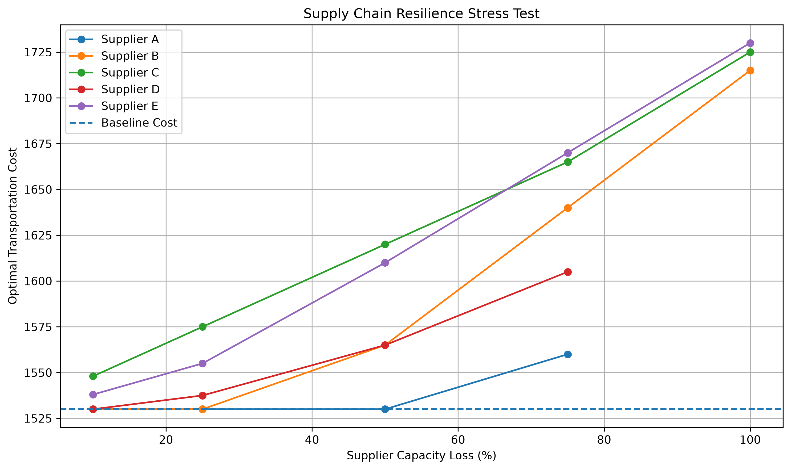
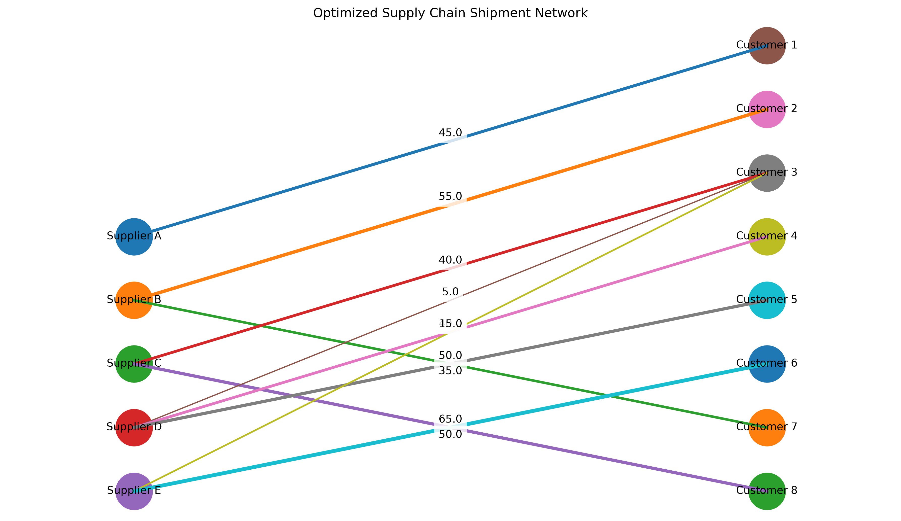

# Supply Chain & Logistics Network Optimizer

A Python decision-support project that finds a minimum-cost shipment plan and explores how supplier capacity losses affect that plan. It uses a continuous transportation linear program, solved with SciPy's `linprog` and its default HiGHS backend.

**Included synthetic example:** 5 suppliers × 8 customers, 40 shipment variables, and a baseline objective of **1,530**. Reducing Supplier B's capacity by 50% raises the objective to **1,565**: an increase of **35 (2.29%)**. These are synthetic cost units, not business savings or production results.

The model minimizes route cost × shipment quantity, subject to supplier capacity limits, exact customer demand, and nonnegative shipments. Beyond the baseline solution, it evaluates 25 single-supplier disruption scenarios and reports constraint slack and local marginal values.

## Run it

Run these commands from a terminal with Python installed:

```bash
git clone https://github.com/pranav-kamal25/supply-chain-network-optimizer.git
cd supply-chain-network-optimizer
python3 -m venv .venv
source .venv/bin/activate
python -m pip install -r requirements.txt
python -m unittest -v test_main
python main.py
```

On Windows, use `python` to create the environment and `.venv\Scripts\activate` in Command Prompt to activate it.

Run from the repository root: input and output paths are relative to the current directory. The program uses the three `*_large.csv` files, prints the results, and saves two charts under `outputs/`. Close the first chart window to continue to the second. For a terminal-only run on macOS/Linux:

```bash
MPLBACKEND=Agg python main.py
```

With this noninteractive backend, Matplotlib may warn that figures cannot be shown; the PNG files are still saved. The included output directory must exist.

## Why this problem matters

A feasible shipment plan can still be unnecessarily expensive or depend heavily on a small number of suppliers. This project connects three questions: which routes should carry flow, which capacity constraints matter economically, and how much a disrupted network costs to operate after re-optimization.

## Mathematical model

Let $I$ be the suppliers, $J$ the customers, $s_i$ supplier capacity, $d_j$ customer demand, and $c_{ij}$ per-unit transportation cost. The continuous decision variable $x_{ij}$ is the quantity shipped from supplier $i$ to customer $j$.

$$
\min_x \sum_{i\in I}\sum_{j\in J} c_{ij}x_{ij}
$$

subject to:

$$
\sum_{j\in J}x_{ij}\leq s_i \quad \forall i\in I
$$

$$
\sum_{i\in I}x_{ij}=d_j \quad \forall j\in J
$$

$$
x_{ij}\geq 0 \quad \forall i\in I, j\in J
$$

The implementation generates the supplier/customer sets and Cartesian product of routes from the data. It builds the objective vector, capacity inequality matrix, and demand equality matrix using Python lists. `linprog` supplies nonnegative bounds and HiGHS through its defaults. Network dimensions are not hard-coded into the model builders.

## Inputs

| File | Required columns | Purpose |
| --- | --- | --- |
| `suppliers_large.csv` | `supplier,capacity` | Five supplier capacities |
| `customers_large.csv` | `customer,demand` | Eight customer demands |
| `shipping_costs_large.csv` | `supplier,customer,cost` | Costs for all 40 routes |

The loaders treat identifiers as strings and parse numeric CSV fields as integers. Each supplier/customer route needs a cost entry. The large example has total capacity 500 and demand 400.

Smaller CSV files without the `_large` suffix are also included. They contain **three** suppliers and three customers. The **580** regression-test objective comes from a separate **two-supplier, three-customer fixture inside `test_main.py`**, not a claim about those smaller CSV files.

To use another dataset, replace the contents of the three large input files while preserving their headers, or change the three filenames in `main()`. No command-line dataset selector is implemented.

## Architecture and validation

`main.py` contains the complete workflow in named functions:

| Stage | Functions |
| --- | --- |
| CSV ingestion | `load_suppliers`, `load_customers`, `load_shipping_costs` |
| Model construction | `generate_routes`, `build_cost_vector`, supplier/customer matrix and vector builders |
| Optimization | `solve_transportation_model`, `solve_scenario` |
| Solution checks | `validate_solution`, `calculate_total_cost` |
| Disruptions | `apply_supplier_disruption`, `run_resilience_stress_test`, `summarize_resilience_results` |
| Interpretation | `analyze_sensitivity`, solution and stress-test printers |
| Charts | `plot_resilience_results`, `plot_shipment_network` |

The loaders reject negative capacities and demands. The main workflow checks aggregate supply and missing routes, checks solver success, and validates baseline capacity, demand, and nonnegativity with a tolerance of `1e-9`. It independently recomputes the baseline cost from route flows. The program prints validation status; it does not assert equality between the recomputed cost and `result.fun` or stop on a failed solution validation.

## Reproduced results

| Scenario | Objective | Change from baseline |
| --- | ---: | ---: |
| Baseline | 1,530 | — |
| Supplier B loses 50% capacity | 1,565 | +35 / +2.29% |
| Supplier E loses 100% capacity | 1,730 | +200 / +13.07% |
| Supplier A loses 100% capacity | Infeasible | — |
| Supplier D loses 100% capacity | Infeasible | — |

The stress test independently reduces each supplier's capacity by 10%, 25%, 50%, 75%, and 100%, solving 25 scenarios. Each starts from the original capacities. It reports feasible objectives, absolute/percentage increases, first observed infeasibility levels, and tested disruptions with no cost increase. Thresholds refer only to the sampled levels.

### Sensitivity analysis

The baseline has binding capacity constraints for Suppliers C and E. Their reported values of one additional capacity unit are 2 and 1 cost units respectively, obtained by negating the capacity marginals. A, B, and D have unused capacities of 75, 10, and 15. Customer equality marginals report the local change in optimal cost with demand.

Marginals are local LP sensitivity information; they are not guarantees for large changes. Disruption scenarios are re-solved rather than extrapolated from these marginals.

## Genuine program outputs

### Resilience stress test



Only feasible scenarios appear as points. Lines connect the sampled points and should not be interpreted as a continuous threshold search.

### Optimized shipment network



Only positive flows appear; line width increases with shipment quantity. Dense route labels may overlap. The printed shipment plan provides the exact values.

## Tests

The existing `unittest` suite contains **17 tests**, all passing in the verified local environment. It covers model construction, CSV route costs, negative capacity/demand rejection, the 580-objective regression fixture, valid solution checks, independent cost calculation, disruption arithmetic, preservation of original capacities, scenario solving, scenario counts, and detection of failed disruption scenarios.

```bash
python -m unittest -v test_main
```

These tests do not provide exhaustive malformed-input coverage or chart-layout validation. See [verification notes](VERIFICATION.md) for the environment and audit scope.

## Repository structure

```text
main.py                         # Model, analysis, plots, entry point
test_main.py                    # 17 existing tests
requirements.txt               # SciPy and Matplotlib
README.md
VERIFICATION.md
.gitignore
suppliers.csv                   # Smaller three-supplier dataset
customers.csv
shipping_costs.csv
suppliers_large.csv             # Default five-supplier dataset
customers_large.csv
shipping_costs_large.csv
outputs/
    optimized_shipment_network.png
    resilience_stress_test.png
```

## Scope and limitations

- Synthetic, single-period, direct supplier-to-customer transportation network with linear costs and divisible shipments.
- No integer decisions, inventory, intermediate warehouses, vehicle routing, demand forecasting, or production deployment.
- Dense matrices grow with network size; dynamic construction is not a benchmark of large-scale performance.
- Duplicate identifiers/routes can overwrite earlier rows. Empty or malformed data, non-finite values, and unknown route identifiers are not comprehensively validated.
- All unsuccessful disruption solves are labeled infeasible, without distinguishing other solver errors.
- Percentage changes assume a positive baseline objective. Disruption percentages passed directly to the helper are not range-validated.
- Scenario solutions use solver results directly; the independent feasibility checks apply to the baseline.
- Dependencies are unpinned; the verified versions are recorded separately.

## License

No license has been selected. This repository does not currently grant an explicit open-source license.
